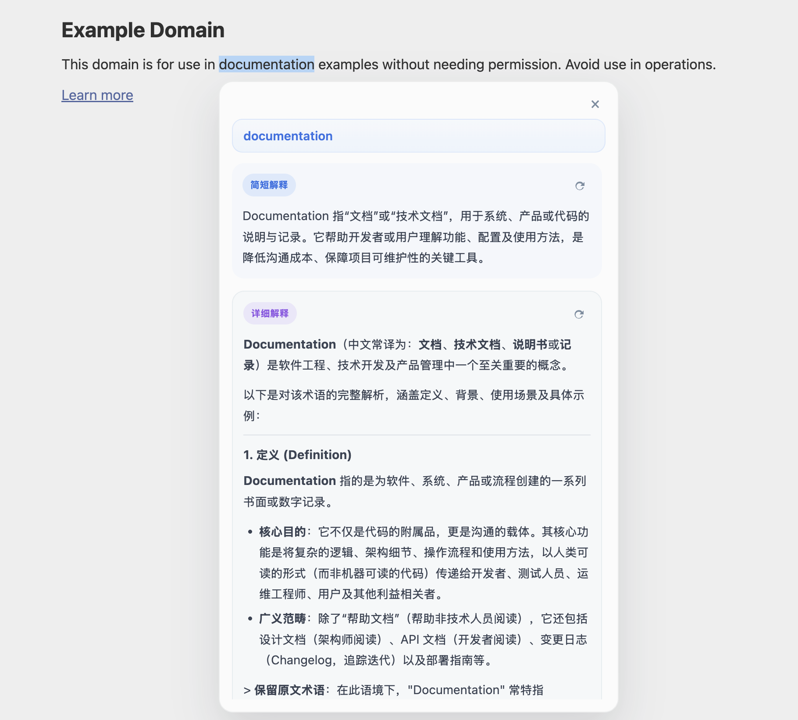

# SnapInsight

SnapInsight is a Chrome extension that provides instant, layered explanations for selected text through a lightweight in-page hover interaction. All explanation requests stay on the local machine through a FastAPI service that calls Ollama.

The repository now also includes a macOS companion-app MVP that can manage the existing local API for a more productized local-first startup flow.

## What It Looks Like



The current in-page experience is:

- Select a short `1-20` unit text snippet on a normal webpage
- Hover the `SI` trigger near the selection
- Read a streamed short explanation first
- Click `查看更多` to expand a streamed detailed explanation in the same card
- Use the small regenerate icons in the short/detail sections to re-run generation

## Prerequisites

- Chrome desktop browser
- Node.js and npm
- Python 3.11+
- Ollama running locally on `127.0.0.1:11434`
- At least one Ollama model installed, for example `llama3.1:8b`

## Local Setup

### 1. Install extension dependencies

```bash
cd extension
npm install
```

### 2. Create the project-local Python environment

```bash
cd /path/to/SnapInsight
python3 -m venv .venv
source .venv/bin/activate
pip install -e ./server pytest
```

### 3. Make sure Ollama is ready

Example:

```bash
ollama serve
ollama pull llama3.1:8b
```

### 4. Optional: install the companion app MVP in the local venv

```bash
cd /path/to/SnapInsight
source .venv/bin/activate
pip install -e ./companion
```

## Build And Load The Extension

### 1. Build the extension bundle

```bash
cd extension
npm run build
```

### 2. Load the unpacked extension

1. Open `chrome://extensions`
2. Enable Developer mode
3. Click `Load unpacked`
4. Select `extension/dist`
5. Copy the generated extension ID

The local API validates the configured extension identity, so you need that ID before starting the server.

## Run The Local API

From the repository root:

```bash
source .venv/bin/activate
cd server
SNAPINSIGHT_TRUSTED_EXTENSION_ID=<your-extension-id> python -m uvicorn app.main:create_app --factory --host 127.0.0.1 --port 11435
```

You can also provide `SNAPINSIGHT_TRUSTED_EXTENSION_ORIGIN=chrome-extension://<your-extension-id>` instead of the ID-only variable.

## Run The Companion App MVP

The current MVP is macOS-only and manages the existing local API as a subprocess. It still expects Ollama to be installed separately.

1. Create the local companion config file at `~/Library/Application Support/SnapInsight/companion-config.json`
2. Add your unpacked extension id:

```json
{
  "trusted_extension_id": "<your-extension-id>",
  "auto_start_service": true,
  "launch_at_login": false
}
```

3. Launch the companion app from the repository environment:

```bash
cd /path/to/SnapInsight
source .venv/bin/activate
python -m snapinsight_companion
```

Useful development command:

```bash
cd /path/to/SnapInsight
source .venv/bin/activate
python -m snapinsight_companion --status-once
```

What the MVP currently does:

- starts and stops the existing local API
- checks whether the local API is healthy
- checks whether Ollama is reachable
- shows model-catalog readiness
- opens the local config and logs location
- shows an `SI` menu-bar title to match the extension trigger
- persists menu toggles for local-API auto-start and Launch at Login
- can register or unregister a macOS login item when running from the packaged app

### Build A macOS `.app`

```bash
cd /path/to/SnapInsight
source .venv/bin/activate
pip install -e "./companion[build]"
python companion/scripts/build_macos_app.py
```

The build currently outputs `companion/dist/SnapInsight.app` and stages the current `server/app` sources into the packaged app resources.

## First-Run Flow

When no model has been saved yet:

1. Load the extension and start the local API
2. Open a normal webpage and select a short text snippet
3. Hover the trigger to open the card
4. Choose an available Ollama model inside the card and save it
5. Wait for the short explanation to stream, then optionally expand the detailed explanation

## Quick Verification

1. Open any normal webpage.
2. Select a short `1-20` unit text snippet.
3. Hover the SnapInsight trigger.
4. Confirm the card streams a short explanation.
5. Confirm the original page selection remains visible after the card opens.
6. Click the short-section regenerate icon and confirm the short explanation can be regenerated.
7. Click `查看更多` and confirm the detailed explanation expands inside the same card.
8. While the detailed explanation is still streaming, scroll inside the card and confirm the scrolling remains usable.
9. Click the detail-section regenerate icon and confirm the detailed explanation can be regenerated.
10. Open the extension options page and confirm model selection loads and saves successfully.

## Companion App MVP Verification

1. Set `trusted_extension_id` in `~/Library/Application Support/SnapInsight/companion-config.json`.
2. Launch `python -m snapinsight_companion --status-once` and confirm it reports local status instead of crashing.
3. Launch `python -m snapinsight_companion` on macOS.
4. Confirm the menu-bar app can start the local API.
5. Confirm the menu-bar app shows Ollama reachability and model-catalog state.
6. Stop the local API from the menu-bar app and confirm the API becomes unavailable.

## Development Commands

### Extension

```bash
cd extension
npm test
npm run check
npm run build
```

### Server

```bash
cd /path/to/SnapInsight/server
source ../.venv/bin/activate
pytest
```
