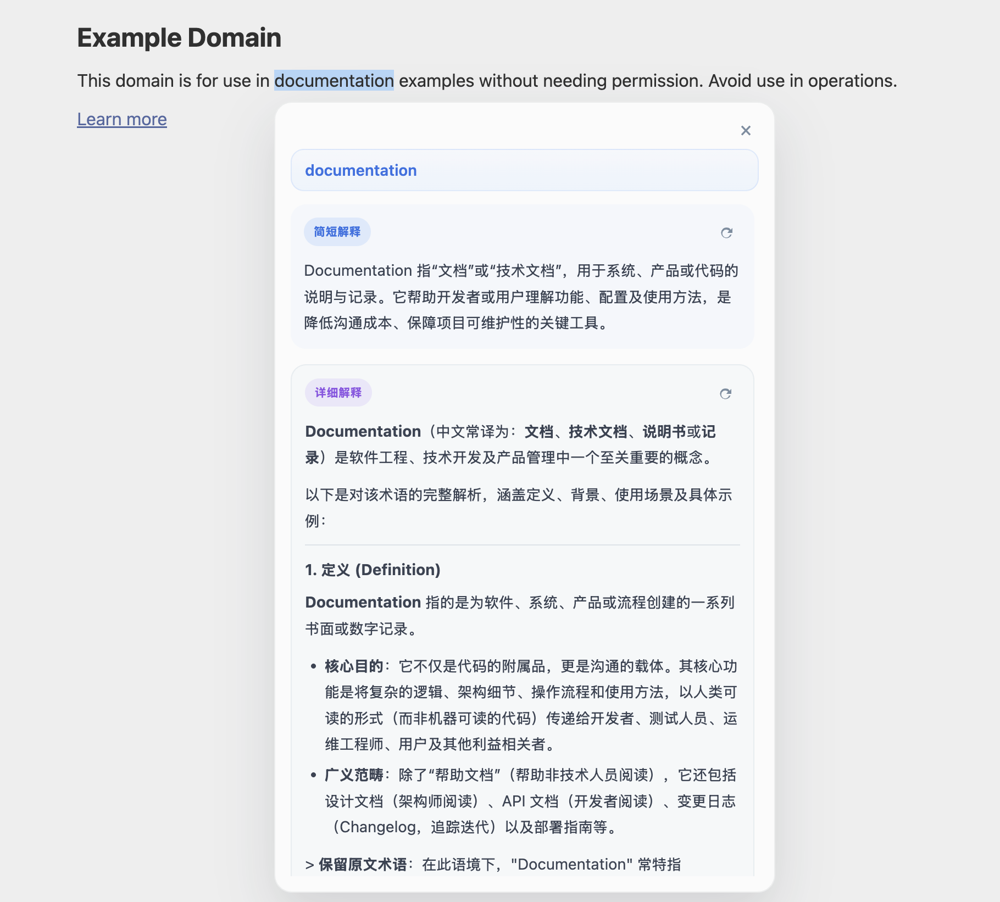

# SnapInsight

**Private, on-device explanations for selected text in Chrome.**

[English](README.md) | [简体中文](README.zh-CN.md)

SnapInsight is a lightweight Chrome extension powered by Chrome's built-in Prompt API. Select a word or short phrase, hover over the `SI` trigger, and get a concise or detailed explanation without leaving the page.

The model runs on the device and is managed by Chrome. SnapInsight has no backend, requires no account, and does not send selected text to SnapInsight or a third-party model API.



## Features

- In-page explanations for explicitly selected text
- Short and detailed response modes
- Streaming output with copy, retry, cancellation, and keyboard controls
- Shadow DOM interface that stays isolated from the host page
- On-device inference through Chrome's built-in Prompt API
- No account, companion app, local server, telemetry, or remote code

## Requirements

- Chrome 138 or later
- A desktop device supported by Chrome's built-in AI
- Sufficient free storage for Chrome's on-device model
- Internet access for the initial model download

Prompt API availability depends on the Chrome version, device, region, and language. Chinese output has been tested successfully, but language support remains controlled by Chrome.

SnapInsight works on ordinary webpages where Chrome allows Content Script injection. Restricted pages such as `chrome://` pages and the Chrome Web Store are not supported. Access to local `file://` pages must be enabled manually in Chrome's extension settings.

## Install from source

```bash
git clone https://github.com/cogito0823/SnapInsight.git
cd SnapInsight/extension
npm ci
npm run build
```

Then load the extension:

1. Open `chrome://extensions`.
2. Enable **Developer mode**.
3. Click **Load unpacked**.
4. Select `extension/dist`.
5. On the device status page, click **Prepare local model**.

After Chrome finishes preparing the model, open an ordinary webpage, select 1–20 Chinese characters or English words, and hover over the `SI` trigger.

## Development

```bash
cd extension
npm ci
npm run check
npm test
npm run build
```

Use `npm run dev` for watch builds. After rebuilding, reload the extension from `chrome://extensions` and refresh the page being tested.

Local and CI validation builds keep the current Manifest version and are
identified by their Git commit SHA. Only a release pull request changes the
formal version, and only a version tag creates a GitHub Release. See the
[release process](docs/product/release-process.md) and
[changelog](CHANGELOG.md).

## Architecture

```text
Webpage
  └── Content Script
        ├── selection detection
        ├── Shadow DOM explanation card
        └── Chrome Prompt API session
              └── Chrome-managed on-device model

Manifest V3 Service Worker
  └── installation flow and toolbar entry point
```

Inference runs directly in the Content Script's isolated world. Selection, generation, streaming, and cancellation stay within the current page instance. The Service Worker does not proxy model requests.

## Privacy and permissions

SnapInsight processes only the text explicitly selected by the user and its screen coordinates. It does not read surrounding paragraphs, page titles, form data, or browsing history. Selected text and generated responses are not persisted.

The Manifest uses `content_scripts.matches: ["<all_urls>"]` so the `SI` trigger can appear after a selection without requiring a toolbar click first. This access is used only for selection detection and rendering the in-page interface. The extension does not request `tabs`, `history`, `webRequest`, or `offscreen` permissions.

For details, see the [privacy policy](docs/product/privacy-policy.md) and [compatibility notes](docs/product/compatibility.md).

## Repository layout

```text
extension/   Chrome extension source and tests
docs/        Product, design, validation, and release documentation
release/     Local release artifacts (not tracked by Git)
```

## Contributing

Issues and pull requests are welcome. Before submitting a change:

1. Keep the extension's single-purpose, on-device privacy model intact.
2. Add or update tests for behavior changes.
3. Run `npm run check`, `npm test`, and `npm run build` in `extension/`.
4. Describe any permission, privacy, or compatibility impact in the pull request.

Use [GitHub Issues](https://github.com/cogito0823/SnapInsight/issues) for bug reports and feature proposals.

## License

SnapInsight is available under the [MIT License](LICENSE).
