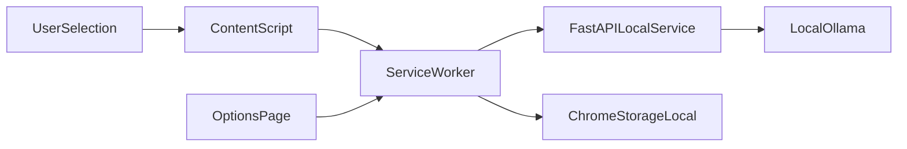
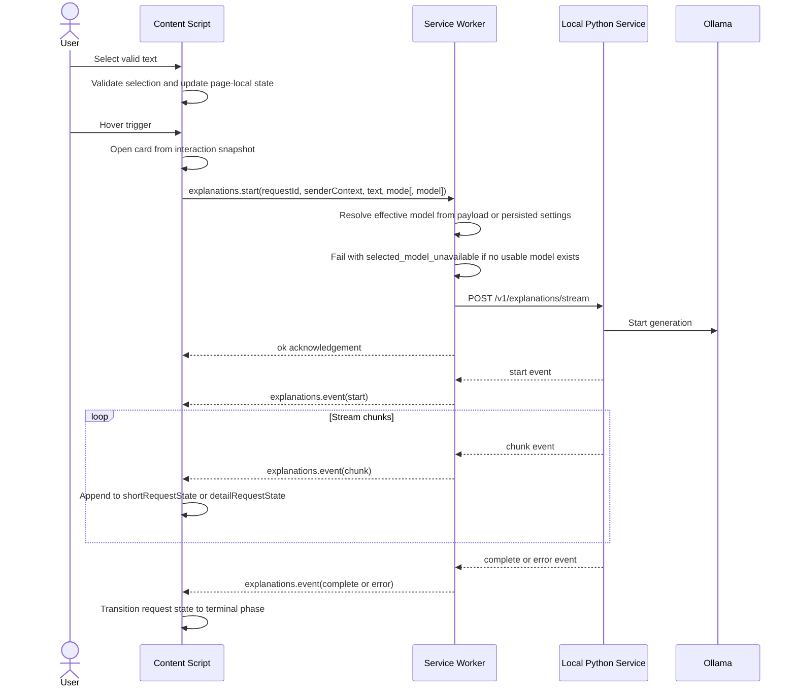
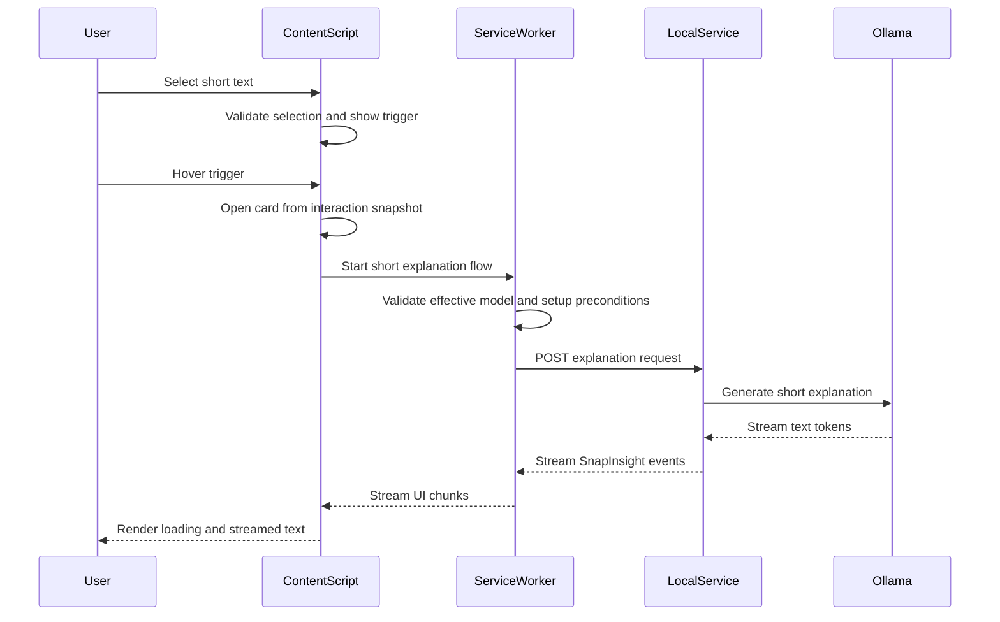

# SnapInsight Extension and Local Service Design

## Document Status

- Status: Approved
- Related Documents:
  - `docs/prd/PRD-snapinsight.md`
  - `docs/rfcs/RFC-001-extension-architecture.md`
  - `docs/rfcs/RFC-002-local-communication-and-security.md`
  - `docs/rfcs/RFC-003-python-service-and-ollama-integration.md`
  - `docs/design/repository-and-code-structure.md`
  - `docs/design/implementation-design/worker-settings-and-local-api-implementation-design.md`
  - `docs/design/implementation-design/options-page-and-settings-surface-implementation-design.md`
  - `docs/design/implementation-design/content-script-interaction-implementation-design.md`
  - `docs/design/implementation-design/server-streaming-and-orchestration-implementation-design.md`
  - `docs/specs/api-spec.md`
  - `docs/specs/extension-state-spec.md`

## 1. Purpose

This document describes how the accepted SnapInsight v1 product direction will be implemented across the Chrome extension and the local Python service.

It does not reopen architectural choices already settled in the RFCs. Instead, it translates those decisions into module responsibilities, interaction flows, and implementation guidance.

## 2. Design Goals

- Preserve a lightweight in-page interaction around text selection
- Keep localhost communication centralized in the extension service worker
- Keep Ollama-specific details behind the Python service
- Support streaming text display for both short and detailed explanations
- Support best-effort request cancellation when the user changes context
- Keep design ownership aligned with `docs/specs/api-spec.md` and `docs/specs/extension-state-spec.md`

## 3. Non-Goals

- Cross-browser support beyond Chrome v1
- Remote model providers
- Query history or result persistence
- Automatic bootstrap of the Python service
- Complex multi-card or sidebar interaction models

## 4. System Overview



The options page should use service-worker-backed settings flows rather than owning a separate direct-write path to `chrome.storage.local`.

### 4.1 Runtime Request Sequence

The following sequence shows the main v1 explanation flow from selection to streamed rendering.



## 5. Runtime Components

### 5.1 Chrome Extension

#### Content Script

Responsibilities:

- Detect text selection in normal page text and `input` / `textarea`
- Validate whether the current selection is in scope
- Compute anchor geometry for the floating trigger and explanation card
- Render the in-page UI inside a Shadow DOM root
- Manage page-local interaction state:
  - floating trigger visibility
  - card open/close state
  - short explanation stream state
  - detailed explanation expanded state
  - per-view loading and error state
- Freeze the accepted selection into a card-scoped interaction snapshot once the user successfully opens the card
- Send structured requests to the service worker
- Attach page-instance routing context to active explanation requests, including `tabId`, `frameId`, and a per-document `pageInstanceId`
- Abort or replace page-local request state when the user selects a new term or closes the card

Non-responsibilities:

- Direct localhost HTTP calls
- Ollama-specific prompt building
- Persistent settings ownership

#### Service Worker

Responsibilities:

- Act as the only extension layer allowed to call `127.0.0.1:11435`
- Attach the worker-controlled `X-SnapInsight-Extension-Id` header on all local API requests so the server can fall back to extension-id validation when browser-provided `Origin` behavior is missing or incompatible
- Provide an internal message API for:
  - health checks
  - model list fetch
  - explanation stream start
  - best-effort request cancellation
  - settings read/write
- Normalize network and service errors into stable extension-facing result types
- Read and write persistent settings in `chrome.storage.local`
- Coordinate model selection requirements for first use
- Validate `selectedModel` updates against the current model catalog before persistence
- Treat explanation startup as the authoritative gate for in-page explanation attempts, including model validation and blocked setup outcomes
- Maintain the active stream bridge for each page instance while requests are running
- Route stream chunks and cancellations using both `requestId` and sender context
- Fail active UI requests cleanly if the MV3 bridge is lost or the worker can no longer continue the stream
- Normalize wrong-service fixed-port responses into a dedicated `local_service_conflict` error result
- Apply the same `local_service_conflict` mapping consistently regardless of whether wrong-service identity is discovered during health check, model-list loading, or stream setup

Non-responsibilities:

- DOM or selection geometry handling
- Direct card rendering

#### Options Page

Responsibilities:

- Present persistent configuration UI
- Show available models and the current selected model
- Let the user update the selected model
- Surface service-health and model-availability errors in a stable settings context
- Load and save settings through the service worker's settings message flow rather than maintaining a separate storage-write path

The options page is the long-lived settings surface. The in-page card may present a lightweight first-use picker only when the user is blocked from making an explanation request.

The lightweight in-page picker is a blocked-flow escape hatch, not a second persistent settings surface. It should reuse the same `settings.setSelectedModel` validation and persistence path as the options page, and it must not write `chrome.storage.local` directly. Cached model data may be shown as a non-authoritative convenience hint, but explanation startup remains blocked until the validated model-selection write succeeds.

For consistency, the options page should follow the same rule: it may render persisted settings state and cached model hints, but selected-model persistence must still go through `settings.setSelectedModel` so live validation remains authoritative.

Model-selection update rule:

- A selected model should only be persisted if it is currently present in the available model list.
- If the requested model is no longer selectable, the update should fail with `selected_model_unavailable` and the user should be prompted to choose again.
- If the model catalog cannot be trusted because the service is unreachable, the wrong service is bound to the fixed port, or the catalog cannot be loaded for retryable reasons, the update should fail with the same stable error families used elsewhere in the extension contract.

### 5.2 Local Python Service

#### API Layer

Responsibilities:

- Expose the localhost HTTP API on `127.0.0.1:11435`
- Validate the allowed extension identity using the trusted extension `Origin` and the worker-controlled fallback header
- Parse requests and stream structured response events
- Map internal failures to stable product error codes
- Use HTTP status codes for failures detected before stream establishment
- Use terminal stream `error` events for failures that occur after a stream has already started
- Expose a stable service identifier so the extension can verify that the fixed port belongs to SnapInsight

#### Model Catalog

Responsibilities:

- Query available models from Ollama
- Return model data in a UI-friendly format
- Detect when a previously selected model is no longer available
- Distinguish “no models installed” from “Ollama currently unavailable”

#### Explanation Orchestrator

Responsibilities:

- Validate request mode: `short` or `detailed`
- Build explanation prompts from request data
- Call the Ollama adapter
- Convert upstream stream tokens into SnapInsight response events
- Stop work early when cancellation or disconnect is detected

#### Ollama Adapter

Responsibilities:

- Encapsulate Ollama endpoint selection and request formatting
- Stream model output back to the orchestrator
- Translate low-level Ollama failures into internal service errors

## 6. Interaction and Data Flows

### 6.1 Primary Flow



For the in-page hover-triggered flow, `explanations.start` should be the authoritative startup path. The content script may use already-loaded model state only as a UI convenience hint, but it should not require a separate selected-model read as the authoritative gate before every explanation attempt.

### 6.2 Detailed Explanation Flow

1. User clicks `查看更多`.
2. Content script keeps the existing card open and expands the detail area.
3. Detailed explanation should start only after the short explanation for the same card has already produced visible streamed content, represented by at least one streamed chunk and a non-empty short-response buffer.
4. Content script allocates a dedicated detail-request state separate from the short-explanation request state.
5. Content script sends a `detailed` mode request through the service worker using the same card-scoped interaction snapshot and effective model.
6. The service worker opens a second explanation stream for the same selected text and chosen model.
7. The content script renders detail-area loading and streamed detail chunks.
8. If the detailed request fails, the short explanation remains visible and only the detail area shows the error and retry action.
9. Repeated detail triggers during an active detail request should be deduplicated rather than opening parallel detail streams.
10. Detail retry should replace the affected detail-request state rather than creating an additional concurrent detail stream.
11. If the short request never produced visible streamed content, including startup failure, pre-stream failure, or terminal `error` with an empty short buffer, detailed explanation should remain blocked.

### 6.3 Request Replacement and Cancellation

When the user selects a new term while a previous request is active:

1. Content script closes the old card view state.
2. Content script asks the service worker to cancel the in-flight request if possible.
3. Service worker aborts the local fetch stream.
4. Python service detects disconnect or cancellation and stops upstream work on a best-effort basis.
5. Content script opens a fresh interaction state for the new selection.

When the user closes the card:

- The same best-effort cancellation path applies to any in-flight detail or short request.

### 6.4 Setup-Time Failure Versus In-Stream Failure

- If a request fails before the explanation stream is established, the service worker should treat it as an HTTP failure and normalize it into a product error result.
- If a request fails after streaming has started, the content script should preserve already rendered chunks and treat the terminal stream `error` event as the failure boundary for the affected area.
- The design must not rely on switching HTTP status codes after a `200` streaming response has already begun.

### 6.5 Page Routing and MV3 Bridge Lifetime

- Each active explanation interaction should be scoped by both `requestId` and sender context.
- Sender context should include `tabId`, `frameId`, and a per-document `pageInstanceId`.
- The service worker should maintain stream delivery per active request, keyed by `requestId` plus sender context.
- One page interaction may therefore hold both a short-request stream and a detailed-request stream at the same time when the user expands the existing card.
- If the bridge closes unexpectedly, the affected request should move to a retryable failed state rather than remain pending indefinitely.
- Cancellation requests must target the same scoped interaction identity used for stream delivery.
- A page reload or same-tab navigation must generate a new `pageInstanceId`, so stale stream chunks cannot be delivered into a new document instance.

### 6.6 Card Snapshot and Effective Model Ownership

- Once the user successfully opens the card, the interaction should bind to a card-scoped snapshot of the accepted selection rather than depending on the continued presence of the browser's live selection highlight.
- Loss of the browser-native selection highlight alone should not close the card.
- The card should reset on explicit close, click-away, replacement by a new valid selection, or document-instance change.
- Each open card should also hold one effective model snapshot once explanation startup has been established successfully for that card.
- That effective model should be reused across short explanation, detailed explanation, and per-area retry within the same card by default.
- Unrelated global selected-model changes should apply to newly created interactions, not silently mutate an already open card.
- If the user explicitly resolves a model-selection-blocked state inside the same card, the card may update its effective model snapshot before the next explanation request starts.
- For hover-triggered in-page attempts, the card may ask the service worker to start explanation before a usable model has been confirmed locally; the authoritative startup path is responsible for resolving the effective model or failing cleanly with `selected_model_unavailable`.

### 6.7 Internal Event Delivery Contract

- The worker-to-content-script stream bridge should use one explicit internal event envelope rather than ad hoc forwarded payloads.
- The internal event contract should cover at least:
  - forwarded stream `start` event after stream establishment
  - streamed text chunk delivery
  - successful completion
  - terminal stream error
  - bridge-loss failure after stream acceptance
- optional explicit cancellation outcome when cancellation is surfaced instead of remaining silent
- Bridge-loss failures should be normalized to a retryable `request_failed` state in the content script rather than being treated as silent disconnects.
- The success response from `explanations.start` should be treated as setup acknowledgement only; it should not replace the forwarded `start` event in the runtime contract.

## 7. UI State Model

### 7.1 Page-Local State

The content script should maintain ephemeral state keyed to the currently active selection.

Exact field-level state definitions live in `docs/specs/extension-state-spec.md`. At the design level, the content script owns at least the following state areas:

- `selectedText`
- `selectionAnchorRect`
- `cardPhase`: `hidden`, `triggerVisible`, `open`
- `detailExpanded`
- `activeModel`
- `senderContext`
- `shortRequestState`: exact request-object shape is defined in the state spec and includes lifecycle phase, rendered buffer, normalized error state, effective model and mode, and request timestamps
- `detailRequestState`: the same request-object shape is reused independently for the detailed explanation lifecycle

At the design level, `selectedText`, `selectionAnchorRect`, and `activeModel` should represent the currently accepted card snapshot rather than a continuously live browser selection probe.

This state must be reset when the user explicitly closes the card, clicks away, a new valid selection replaces the old one, or the document instance changes. Loss of the native selection highlight alone should not force a reset.

The content script is also responsible for enforcing the PRD-level product rule that only `1-20` units of selected text should trigger explanation behavior. Requests outside that product limit should never be sent to the local service from normal UI flows.

The v1 counting rule should be:

- trim leading and trailing whitespace before validation
- strip leading and trailing punctuation from the full selection
- split the remaining text by whitespace into segments
- for a segment containing only Latin letters, digits, connector punctuation such as `-` and `'`, count the segment as `1`
- for a segment containing CJK characters, count each visible CJK character as `1`
- for a segment containing both CJK characters and a contiguous Latin/digit run without spaces, count the Latin/digit run as `1` and each CJK character as `1`

Examples:

- `GPT-4` counts as `1`
- `RAG-based agent` counts as `2`
- `AI大模型` counts as `5`

### 7.2 Persistent State

Persistent extension state should live in `chrome.storage.local`.

Exact storage keys live in `docs/specs/extension-state-spec.md`. The initial persistent settings model includes:

- `settings.selectedModel`
- `settings.lastKnownModels` as a non-authoritative convenience cache
- `settings.lastModelRefreshAt` for diagnostics and stale-cache messaging only
- lightweight local settings added later through the options page

The selected text itself must never be persisted.

If live model loading fails, the options page may still display `settings.lastKnownModels` together with `settings.lastModelRefreshAt` as stale diagnostics, but it must not treat that cache as sufficient to validate or persist a new selected model.

## 8. Error Handling Design

The extension should distinguish at least the following product-level error categories:

- `service_unavailable`
- `local_service_conflict`
- `no_models_available`
- `selected_model_unavailable`
- `request_failed`
- `request_cancelled`

Expected UI behavior:

- `service_unavailable`: show a friendly in-card message indicating that the local service is not running
- `local_service_conflict`: show a local setup error indicating that the expected localhost port is occupied by a different service
- `no_models_available`: block explanation requests and guide the user to configure or install a model
- `selected_model_unavailable`: require a fresh model selection before continuing
- `request_failed`: preserve already valid UI state where possible and offer retry for the affected area
- `request_cancelled`: do not show a visible error if cancellation was caused by a user-driven context switch

Blocked setup-state presentation rule:

- For hover-triggered in-page explanation attempts, the card should remain the primary interaction surface for blocked setup outcomes.
- The lightweight in-page picker should be limited to missing or invalid model-selection cases.
- `no_models_available`, `service_unavailable`, and `local_service_conflict` should render as stable in-card blocked or error states with context-appropriate guidance rather than redirecting the user into a different primary interaction surface.

Health and model state interpretation:

- `GET /health` answers whether the SnapInsight local service is reachable and may include dependency hints such as `ollamaReachable`.
- `GET /v1/models` answers whether selectable models are available.
- “No models installed” and “Ollama unavailable” must be represented as different conditions in the extension state machine.
- If the fixed localhost port responds with the wrong service identity, the extension must treat it as a local service conflict and fail closed.
- If the stream bridge disappears unexpectedly after a request has started, the affected interaction should become a retryable `request_failed` state rather than `request_cancelled`.
- The same `local_service_conflict` interpretation must apply no matter which extension entry point discovers the wrong-service identity first.
- `request_cancelled` should only be used when cancellation is explicitly emitted across the extension boundary; silent user-driven cancellation may still result in no visible terminal message.
- `explanations.start` setup failures should be mapped deterministically:
  - unreachable local service -> `service_unavailable`
  - wrong-service identity -> `local_service_conflict`
  - invalid or stale model selection -> `selected_model_unavailable`
  - other startup failure -> `request_failed`
- `settings.setSelectedModel` failures should be mapped deterministically:
  - unreachable local service -> `service_unavailable`
  - wrong-service identity -> `local_service_conflict`
  - invalid or stale model selection -> `selected_model_unavailable`
  - other catalog-load or validation failure -> `request_failed`

## 9. Proposed Implementation Structure

The repository should remain single-repo, but the implementation should be separated clearly:

```text
SnapInsight/
  docs/
  extension/
    src/
      content/
      worker/
      options/
      shared/
    tests/
  server/
    app/
      main.py
      api/
      services/
      adapters/
      schemas/
      core/
    tests/
```

This structure is guidance for implementation and can be refined when code scaffolding begins, as long as the RFC boundaries remain intact. More detailed module layout guidance lives in `docs/design/repository-and-code-structure.md`.

## 10. Design and Spec Boundaries

The following items are specified exactly in `docs/specs/api-spec.md`:

- `GET /health` request and response shape
- `GET /v1/models` response schema
- `POST /v1/explanations/stream` request schema
- streaming event format for start, chunk, completion, and error events
- machine-readable error codes and their meanings
- internal extension message shapes between content script and service worker

The following state structures are specified exactly in `docs/specs/extension-state-spec.md`:

- page-local content-script state
- short and detailed request-state shape
- persistent storage keys and non-persistent data rules
- request lifecycle transitions and reset behavior

The specs make explicit:

- the difference between product input limits and defensive backend validation limits
- the difference between stream-setup HTTP failures and in-stream terminal error events
- the required sender-context fields for routing stream data and cancellation
- the required service-identity check on the fixed localhost port
- the public error mapping for `local_service_conflict`
- the internal failure shape for bridge-loss setup or teardown failures
- the explicit worker-to-content-script event envelope used during active explanation streams

This design document intentionally fixes module ownership and flow behavior first, while leaving exact field-level schemas to the API and state specs.

## 11. Open Implementation Notes

- Rich text editors and `iframe` content remain out of scope for v1 implementation.
- Hover-triggered explanation startup may use a short hover-intent threshold before beginning the actual explanation request, as long as the visible interaction still feels consistent with the PRD's hover-based flow.
- Request-timeout thresholds are still an implementation detail, but the service worker should own timeout enforcement for extension-initiated local-service requests and should normalize timeout outcomes to retryable `request_failed` unless a narrower public contract is later added to the API spec.
- Model-list caching is allowed only as a short-lived optimization and must not override the source of truth from Ollama.
- The worker-to-content-script bridge and/or content-script render path may coalesce very small streamed chunks into fewer UI updates, as long as ordering, completion, and terminal error semantics remain unchanged and the user still perceives progressive streaming output.
- `input` / `textarea` support remains in v1 scope.
- When exact selection-range geometry is available for `input` / `textarea`, the trigger and card should use that geometry.
- When exact range geometry is unavailable but the host element rectangle is stable, the implementation may fall back to anchoring against the element rectangle.
- If no stable anchor can be computed, the implementation should fail closed by suppressing the floating trigger instead of guessing an unreliable position.

## 12. Residual Security Risk

- The v1 fixed-port identity check helps detect ordinary wrong-service and port-conflict situations, but it does not fully authenticate the local process behind the port.
- A malicious local process could still mimic the documented SnapInsight service identity and receive selected text.
- This risk is accepted for v1 and should be revisited if the project later requires stronger local-process trust guarantees.

## 13. Change Record

- Initial design created from the approved PRD and accepted RFC set.
- Aligned design ownership language with the current API and extension-state specs, clarified per-request stream routing, and documented first-use picker and `input` / `textarea` fallback guidance.
- Removed settings-path ambiguity for the options page, aligned the high-level repository structure with `docs/design/repository-and-code-structure.md`, and clarified stale-cache and timeout ownership guidance.
- Clarified card snapshot lifetime, authoritative explanation startup, detail-request gating and deduplication, blocked setup-state presentation, card-scoped effective model ownership, hover-intent guidance, and streamed chunk coalescing allowances.
- Consolidated the canonical startup flow around the accepted authoritative-startup RFC decision and aligned detail eligibility with the accepted visible-content rule from the interaction-lifecycle RFC.
- Updated the local trust boundary so the worker always sends `X-SnapInsight-Extension-Id`, while the server accepts either the trusted extension `Origin` or that worker-controlled fallback header when validating localhost requests.
