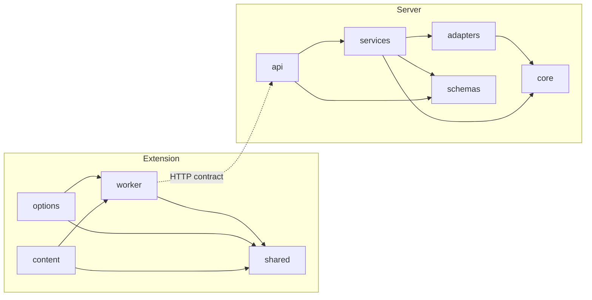

# SnapInsight Repository and Code Structure Design

## Document Status

- Status: Draft
- Related Documents:
  - `docs/rfcs/RFC-001-extension-architecture.md`
  - `docs/rfcs/RFC-002-local-communication-and-security.md`
  - `docs/rfcs/RFC-003-python-service-and-ollama-integration.md`
  - `docs/design/extension-and-local-service-design.md`
  - `docs/specs/api-spec.md`
  - `docs/specs/extension-state-spec.md`

## 1. Purpose

This document defines the recommended repository layout and module boundaries for SnapInsight v1.

It turns the high-level structure from `docs/design/extension-and-local-service-design.md` into a more implementation-ready code organization plan.

## 2. Design Goals

- Keep extension runtime boundaries explicit: content script, service worker, options page, and shared contracts.
- Keep Python service boundaries explicit: API layer, application services, adapters, and schemas.
- Avoid accidental cross-layer coupling.
- Make it obvious where new code should be added during implementation.
- Keep v1 small enough to scaffold quickly without overengineering.

## 3. Repository Scope

Recommended top-level layout:

```text
SnapInsight/
  docs/
  extension/
  server/
  scripts/
  .gitignore
  README.md
```

Top-level rules:

- `docs/` contains discovery, RFC, design, spec, and implementation planning documents.
- `extension/` contains the Chrome extension implementation and build setup.
- `server/` contains the local Python service implementation and packaging.
- `scripts/` is optional and should only hold lightweight developer automation scripts.

## 4. Extension Structure

### 4.1 Proposed Layout

```text
extension/
  public/
    manifest.json
    icons/
  src/
    content/
      bootstrap/
      selection/
      anchor/
      ui/
      state/
      messaging/
    worker/
      bootstrap/
      handlers/
      bridge/
      settings/
      local-api/
    options/
      bootstrap/
      components/
      state/
      actions/
    shared/
      contracts/
      errors/
      state/
      models/
      utils/
  tests/
    unit/
    integration/
```

### Module Dependency Overview

The following diagram highlights the intended dependency direction between the main runtime areas.



### 4.2 Module Responsibilities

#### `src/content/`

Owns page-local behavior.

Recommended submodules:

- `bootstrap/`: content-script entrypoint and lifecycle wiring
- `selection/`: selection extraction, validation, and selection-change handling
- `anchor/`: viewport geometry normalization for trigger and card placement
- `ui/`: Shadow DOM mount, trigger, card, loading, and error rendering
- `state/`: page-local state container and reducers or transition helpers
- `messaging/`: communication with the service worker

#### `src/worker/`

Owns extension-global coordination.

Recommended submodules:

- `bootstrap/`: worker startup, message registration, alarm or lifecycle hooks if later needed
- `handlers/`: message-type entrypoints such as `models.list`, `settings.get`, `settings.setSelectedModel`, `explanations.start`, and cancellation
- `bridge/`: long-lived stream delivery, sender-context routing, and bridge-loss handling
- `settings/`: persistence reads and writes to `chrome.storage.local`
- `local-api/`: HTTP client for `GET /health`, `GET /v1/models`, and streaming requests

#### `src/options/`

Owns the settings page.

Recommended submodules:

- `bootstrap/`: page entrypoint
- `components/`: UI components
- `state/`: local view state for loading, selection, and save error
- `actions/`: calls into service-worker-backed settings flows

#### `src/shared/`

Owns contracts shared across extension runtimes.

Recommended submodules:

- `contracts/`: internal message types and stream event envelopes
- `errors/`: normalized error codes and mapping helpers
- `state/`: shared state interfaces from `docs/specs/extension-state-spec.md`
- `models/`: common model summary interfaces and helpers
- `utils/`: narrow pure utilities that do not belong to a runtime-specific layer

### 4.3 Placement Rules

- content-script UI code must not import worker-only modules
- worker HTTP code must not import DOM-only modules
- options-page code must reuse shared types but keep its own view logic
- shared modules must remain free of DOM APIs and Chrome runtime side effects when practical

### 4.4 Suggested Entry Files

Initial scaffold can start with:

```text
extension/
  src/
    content/index.ts
    worker/index.ts
    options/index.ts
    shared/contracts/messages.ts
    shared/contracts/events.ts
    shared/errors/error-codes.ts
    shared/state/extension-state.ts
    shared/models/model-summary.ts
```

These names are guidance, not a locked contract.

## 5. Server Structure

### 5.1 Proposed Layout

```text
server/
  app/
    main.py
    api/
      health.py
      models.py
      explanations.py
    services/
      health_service.py
      model_catalog_service.py
      explanation_service.py
      cancellation_service.py
    adapters/
      ollama_client.py
    schemas/
      health_schema.py
      model_schema.py
      explanation_schema.py
      error_schema.py
    core/
      config.py
      errors.py
      logging.py
  tests/
    unit/
    integration/
```

### 5.2 Module Responsibilities

#### `app/api/`

- defines FastAPI routes
- validates request payloads
- converts application results into HTTP responses or stream events

#### `app/services/`

- holds request orchestration and business rules
- enforces selected-model validation rules
- owns stream setup and cancellation behavior

#### `app/adapters/`

- isolates Ollama-specific transport and payload details
- must not leak raw adapter details into extension-facing contracts

#### `app/schemas/`

- contains request and response models aligned with `docs/specs/api-spec.md`
- keeps schema naming explicit and transport-oriented

#### `app/core/`

- contains local service configuration and cross-cutting infrastructure helpers

### 5.3 Placement Rules

- route handlers should stay thin and delegate to services
- Ollama-specific code should stay behind `adapters/`
- service modules should return normalized domain or transport-friendly results, not raw framework exceptions

## 6. Shared Contract Boundaries

The following boundaries should remain explicit across the repo:

- extension internal message contracts live in `extension/src/shared/contracts/`
- local HTTP schemas live in `server/app/schemas/`
- normalization logic for product-level error codes must be consistent with `docs/specs/api-spec.md`

No shared runtime package is required between `extension/` and `server/` in v1. The contract is document-first and may later be code-generated or manually mirrored if the project grows.

## 7. Testing Structure

Recommended test placement:

- extension pure utilities and state transitions -> `extension/tests/unit/`
- extension runtime interaction tests -> `extension/tests/integration/`
- server service logic -> `server/tests/unit/`
- local API contract and streaming tests -> `server/tests/integration/`

Rules:

- tests should follow runtime boundaries rather than becoming a single mixed test tree
- contract examples from `docs/specs/api-spec.md` should be reusable as fixtures where practical

## 8. Naming and Dependency Rules

- prefer names that reflect runtime ownership such as `content`, `worker`, `options`, `shared`
- avoid vague folders such as `common` or `misc`
- keep bidirectional dependencies out of sibling modules
- prefer one-directional dependency flow: runtime module -> shared contracts/utilities

## 9. Future Growth Guidance

This layout should remain workable if the project later adds:

- more options-page settings
- richer content-card rendering
- server-side prompt templates
- better diagnostics and health tooling

The following changes may justify a new structure review:

- browser support beyond Chrome
- remote providers in addition to Ollama
- durable history or favorites storage
- monorepo package extraction or shared generated contracts

## 10. Change Record

- Initial repository and module-structure design created to bridge the gap between high-level architecture docs and upcoming code scaffolding.
