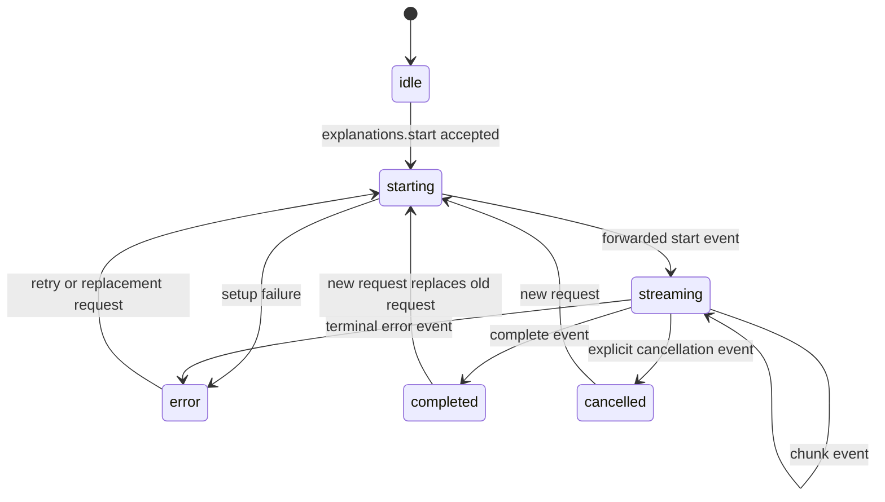

# SnapInsight Extension State Specification

## Document Status

- Status: Draft
- Related Documents:
  - `docs/prd/PRD-snapinsight.md`
  - `docs/design/extension-and-local-service-design.md`
  - `docs/specs/api-spec.md`

## 1. Purpose

This document defines the v1 state model for the Chrome extension implementation.

It makes the following implementation details explicit:

- page-local content-script state
- per-request state for short and detailed explanations
- persistent settings stored in `chrome.storage.local`
- boundaries between ephemeral UI state and durable extension settings

This document does not define:

- HTTP contracts for the local Python service
- prompt construction details
- future history, favorites, sync, or account-backed data models

## 2. Scope

This spec applies to:

- the content script state machine
- the service worker's persistent settings view
- the options page's read and write access to extension settings

This spec does not introduce a database schema. SnapInsight v1 uses browser local storage only.

## 3. Design Principles

- Keep selected text and generated explanation content ephemeral by default.
- Persist only data that is required across page reloads or browser restarts.
- Separate short and detailed explanation state so concurrent requests do not overwrite each other.
- Route active requests using both `requestId` and `senderContext`.
- Fail closed when persistent state depends on a live local-service validation step.

## 4. Common State Types

### 4.1 Selection Mode

Allowed values:

- `short`
- `detailed`

### 4.2 Card Phase

Allowed values:

- `hidden`
- `triggerVisible`
- `open`

### 4.3 Request Phase

Allowed values:

- `idle`
- `starting`
- `streaming`
- `completed`
- `error`
- `cancelled`

### 4.4 Sender Context

The extension must use the same sender-context structure defined in `docs/specs/api-spec.md`.

```json
{
  "tabId": 123,
  "frameId": 0,
  "pageInstanceId": "doc-7f6d6b2d"
}
```

Rules:

- `senderContext` is required for all active explanation requests.
- `pageInstanceId` must change on reload or same-tab navigation.
- stale events with a mismatched `senderContext` must be ignored.

### 4.5 Error State

```json
{
  "code": "request_failed",
  "message": "Explanation generation failed.",
  "retryable": true
}
```

Fields:

- `code`: stable machine-readable error code from `docs/specs/api-spec.md`
- `message`: normalized implementation-facing message
- `retryable`: whether the UI may offer retry

### 4.6 Explanation Request State

The content script should keep separate request objects for short and detailed explanations.

```json
{
  "requestId": "9e86d5ac-35a7-4a59-8d57-8db1f71db9f6",
  "phase": "streaming",
  "textBuffer": "Transformer is a model architecture...",
  "errorState": null,
  "mode": "short",
  "model": "llama3.1:8b",
  "startedAt": "2026-04-10T10:00:00.000Z",
  "updatedAt": "2026-04-10T10:00:03.000Z"
}
```

Fields:

- `requestId`: current active request identity, or `null` when idle
- `phase`: request lifecycle state
- `textBuffer`: accumulated rendered text for the current request
- `errorState`: normalized terminal error object or `null`
- `mode`: `short` or `detailed`
- `model`: effective model id used by the request
- `startedAt`: ISO timestamp for request creation, or `null`
- `updatedAt`: ISO timestamp of the most recent state change, or `null`

Rules:

- `textBuffer` must reset when a new request replaces the old one.
- `errorState` must reset when entering `starting`.
- a request in `completed`, `error`, or `cancelled` is terminal until replaced by a new request.
- unexpected bridge loss after acceptance must transition the affected request to `error`, not `cancelled`.

### 4.7 Request Lifecycle Diagram

The short and detailed request states use the same lifecycle and must evolve independently.



## 5. Page-Local Content Script State

### 5.1 State Shape

```json
{
  "selectedText": "Transformer",
  "selectionAnchorRect": {
    "top": 120,
    "left": 320,
    "width": 86,
    "height": 18
  },
  "cardPhase": "open",
  "detailExpanded": true,
  "activeModel": "llama3.1:8b",
  "senderContext": {
    "tabId": 123,
    "frameId": 0,
    "pageInstanceId": "doc-7f6d6b2d"
  },
  "shortRequestState": {},
  "detailRequestState": {}
}
```

Field requirements:

- `selectedText`: currently active trimmed selection text, or `null`
- `selectionAnchorRect`: normalized viewport-relative anchor geometry, or `null`
- `cardPhase`: current trigger or card visibility phase
- `detailExpanded`: whether the card is showing the detailed section
- `activeModel`: currently effective selected model id, or `null`
- `senderContext`: routing context bound to the current document instance
- `shortRequestState`: request object for short explanation mode
- `detailRequestState`: request object for detailed explanation mode

### 5.2 Initialization Rules

When the content script loads for a document instance, it should initialize:

- a fresh `pageInstanceId`
- `cardPhase = hidden`
- `detailExpanded = false`
- `selectedText = null`
- empty request states in `idle`

### 5.3 Reset Rules

The page-local state must reset when:

- the current selection becomes invalid
- a new valid selection replaces the old one
- the user explicitly closes the card
- a navigation or reload creates a new document instance

Reset means:

- clear `selectedText`
- clear `selectionAnchorRect`
- set `cardPhase = hidden`
- set `detailExpanded = false`
- replace both request states with new idle objects

### 5.4 Replacement Rules

When the user triggers a new short explanation on a different selection:

- the content script must cancel or abandon the old short request
- the content script must also clear any stale detailed result that belongs to the old selection
- a new `senderContext` is not required unless the document instance changed

When the user expands the same card for a detailed explanation:

- the detailed request may start while the short result remains visible
- `detailRequestState` must not mutate `shortRequestState`

## 6. Request Lifecycle Rules

### 6.1 Start Request

On `explanations.start` acceptance:

- the targeted request state enters `starting`
- `requestId` must be recorded immediately
- `textBuffer` must be empty
- `errorState` must be `null`

When the forwarded internal `start` event arrives:

- the request state transitions to `streaming`

### 6.2 Receive Chunk

On each forwarded chunk event:

- append chunk text to `textBuffer`
- keep `phase = streaming`
- refresh `updatedAt`

### 6.3 Completion

On complete event:

- set `phase = completed`
- preserve `textBuffer`
- preserve `requestId` until a new request replaces it

### 6.4 Error

On terminal error event or normalized startup failure:

- set `phase = error`
- preserve partial `textBuffer` if already accumulated
- store normalized `errorState`

### 6.5 Cancellation

On explicit terminal cancellation event:

- set `phase = cancelled`
- do not surface a visible error when the cancellation was user-driven context replacement

If cancellation is implicit because the UI moved to a new selection:

- the implementation may replace the old state directly without first rendering a cancellation result

## 7. Persistent Storage Specification

### 7.1 Storage Area

SnapInsight v1 must persist extension-owned settings in `chrome.storage.local`.

### 7.2 Storage Shape

```json
{
  "settings.selectedModel": "llama3.1:8b",
  "settings.lastKnownModels": [
    {
      "id": "llama3.1:8b",
      "label": "llama3.1:8b",
      "provider": "ollama",
      "available": true
    }
  ],
  "settings.lastModelRefreshAt": "2026-04-10T10:00:00.000Z"
}
```

### 7.3 Key Definitions

#### `settings.selectedModel`

- Type: `string | null`
- Meaning: currently selected default model for explanation requests
- Persistence rule: write only after successful validation against the current live model catalog

#### `settings.lastKnownModels`

- Type: array of model summary objects
- Meaning: non-authoritative convenience cache for UI display
- Persistence rule: may be refreshed from successful `models.list` responses
- Constraint: this cache must not be treated as the source of truth for validation

#### `settings.lastModelRefreshAt`

- Type: ISO timestamp string or `null`
- Meaning: last successful time the extension refreshed the model catalog
- Purpose: diagnostics and stale-cache messaging only

### 7.4 Non-Persistent Data

The following must not be persisted in v1:

- selected page text
- explanation output content
- request ids
- sender context
- page-local geometry
- per-request error state

## 8. Options Page State Rules

The options page may keep a local view model for rendering, but the persisted source of truth remains `chrome.storage.local`.

Minimum local view fields:

- `selectedModelDraft`
- `availableModels`
- `loadingPhase`
- `saveError`

Rules:

- the options page must load `settings.selectedModel` on startup
- saving a new model selection must call `settings.setSelectedModel`
- the options page must not write `settings.selectedModel` directly without the validation flow

## 9. Type Ownership Guidance

The implementation should keep shared extension types in a shared module, for example:

- `SelectionMode`
- `CardPhase`
- `RequestPhase`
- `SenderContext`
- `ExtensionError`
- `ExplanationRequestState`
- `ExtensionSettings`

Type definitions used by both content script and service worker should live in `extension/src/shared/`.

## 10. Open Extension Points

The following additions are expected to remain compatible with this v1 state shape:

- more lightweight settings in `chrome.storage.local`
- richer options-page diagnostics
- additional card presentation fields derived from existing request state

The following would require a new design pass:

- history or favorites persistence
- multi-card concurrency in one page
- background request resume across page reloads
- service-side durable storage

## 11. Change Record

- Initial extension state and local storage specification created after the system design and API spec became stable enough for implementation planning.
